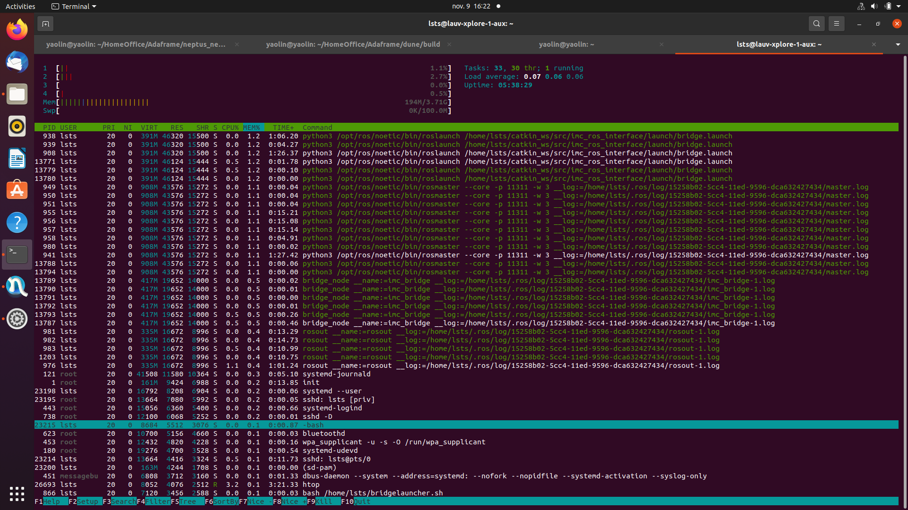
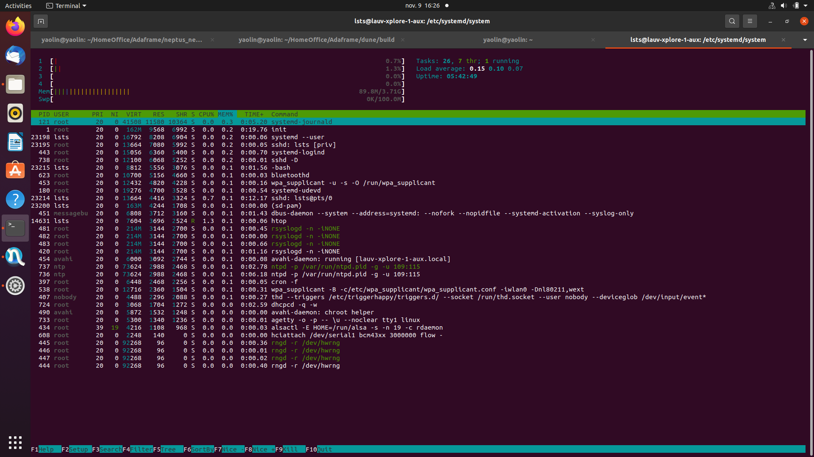

# Introduction

---

The step guide explains the details on how to operate an AUV for MASCOT mission in Douro River, Porto, Portugal.

The guide is composed of three sections. Section I handles what needs to be done on the user-laptop (lsts-dell). Section II shows what needs to be done in the AUV (main CPU, and backseat CPU). Section III introduces some of the basic debug tips.

#### Note: Section I needs to be done first as always, so that the user can monitor the situations around.

---

# Section 0: Threshold

---

Threshold needs to be monitored and updated with the onboard portable CTD sensor. The plan is to drive the boat along the c

---

# Section I: User laptop

---

### Neptus set up guide
1. Launch neptus: `./home/lsts/workspace/neptus/develop/netpus auv`
2. Add plugin:
 * Click **View** on the top menu bar.
 * Click **Plugin Manager**.
 * Find **FollowReference Interaction for NTNU** in the left column.
 * Click **Add**, then NTNU log should appear in the left column in neptus.
3. Click **FollowReference Interaction for NTNU**.
4. Right click anywhere in the map in neptus.
5. Click **Follow Referance Settings**.
6. Change **Control timeout** to *200*.

##### Note: Step 2 only needs to be done once.
---

# Section II: AUV

---

In the AUV, two different scenarios are considered.

* **Scenario I**: ideal situation, when everything works smoothly, then no need to log in to AUV to do anything. Just activate the operation in Neptus.

* **Scenario II**: when something goes wrong.

To tackle these two scenarios, two plans are prepared: **Plan A** for **Scenario I**, and **Plan B** for **Scenario II**.

### **Plan A**
1. Click **FollowReference Interaction for NTNU**.
2. Right click on the map in neptus.
3. Click **Activate Follow Reference for lauv-xplore-1**.

### **Plan B**
1. Launch a new terminal with `Ctrl+Alt+T` in *lsts-dell-1*.
2. Log into the main CPU in *lauv-xplore-1* with `ssh xp1m`, passwd: `root`.
3. Log into backseat CPU in *lauv-xplore-1* with `ssh lsts@10.0.10.123`, passwd: `root`.
4. Launch a multiplexer session with `screen -S mascot`.
5. Clean the repo by `/bin/bash /home/lsts/clean.sh`
6. Shutdown program services by `sudo systemctl stop mascot_op2.service`
7. Shutdown bridge service by `sudo systemctl stop mascot_bridge.service`
8. Check `htop` to see if processes are cleaned.
9. Launch a new bridge with `/bin/bash planb_bridge.sh`.
10. Launch a new mission with `/bin/bash planb_op2.sh`.
11. Wait one or two minutes.
12. Press keys `Ctrl+a` and then `d` to detach from screen session.
13. Activate follow reference for NTNU.

---

# Section III: Debugging

---

In this section, I will list some common issues in a mission operation out in the sea.
* AUV in service mode.
* AUV not moving.
* Not receiving SMS.
* Cannot navigate the AUV.
* USBL not working.
* WIFI not working.

### Diagnosis

* AUV in service mode.
  1. Try to reactivate the operation from neptus. It might be caused by some fish or plastic bottle that triggers the safety margin. If the AUV starts moving after reactivation, then fingers crossed, everything is fine.
  2. If AUV is not moving after reactivation:
    - Follow step 1, 2, 3 in **Plan B**.
    - Type `screen -r` to resume the previous detached session. If it is not working, then skip, it is probably dead already.
    - Type `htop` to check if both programs are running.
    - If none of the services or processes are running, then check the log with `cat /logs/log_op2.txt` first and then `cat /logs/log_bridge.txt` and we should keep in touch at this moment.
---

The following figures show how it should look like from a `htop` printout.

- **Case I**: Everything goes well.

- **Case II**: Adaptive program is dead or finished.

- **Case III**: Both the bridge and the adaptive program are dead.

---

* AUV not moving.
 - Take it easy, it is either popuping on the surface or calculating something. If it is not moving for a long time, recall the first issue.

* Not receiving SMS.
 - Take it easy and be patient.

* Cannot navigate the AUV.
 - Try to find the seagulls, usually they can guide us.

* USBL not working.
 - Cable issues or other batteries etc.

* WIFI not working.
 - Cable issues or other batteries etc.
